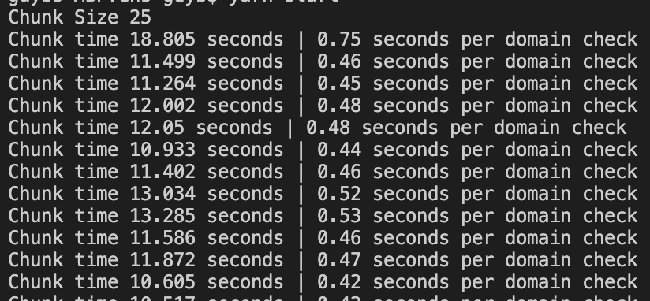

# ENS-scraper

A POC for **ENS** (https://app.ens.domains/) scrapping tool

 **~0.4 seconds for a domain check (per process)**

 
> This is an expirimental code! (not production ready...)
> 
> Last scan available eth addresses: *n-available.txt*

##### Requirements
- yarn >= 3.2.0
- node >=16
- 
##### Run 
- yarn install
- yarn start

