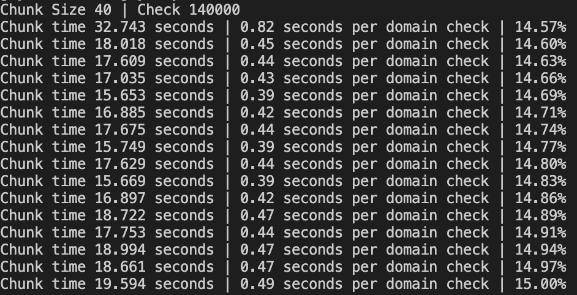

# ENS-scraper

- This project is a POC for **ENS** (https://app.ens.domains/) scrapping tool.
- It generates a list of available eth domains (`example.eth`) by input.
- The speed is depends on the configuration (`./src/constants.ts`) and currently runs in a speed of  **~0.45 seconds for a domain check**

 
> This is an expirimental code! (not production ready...)
> 
> Last scan available eth addresses: *n-available.txt*
>
> Modify *index.ts* to change the search params

##### Requirements
- yarn >= 3.2.0
- node >=16
- 
##### Run 
- yarn install
- yarn start

